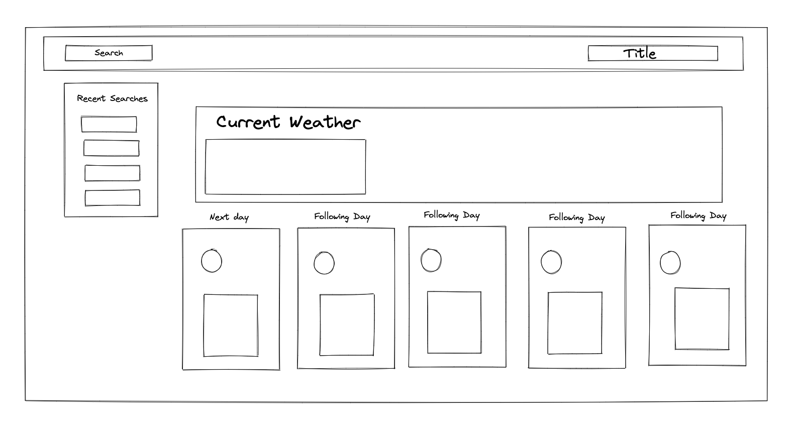
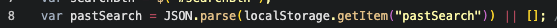
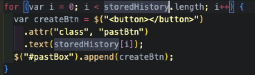

# 5-day-forecast

## Goal

Create a user friendly web application that will display a the weather condition of a disired location. As well as the next 5 days. The project is meant to be built using bootstrap and jqueary to design the site and display the data in a easy to read layout. The data being used is from a third-party API known as Open Weather.

## User Story

The given User Story is as follows:

    AS A traveler
    I WANT to see the weather outlook for multiple cities
    SO THAT I can plan a trip accordingly

## Acceptance Criteria

    GIVEN a weather dashboard with form inputs
        WHEN I search for a city
        THEN I am presented with current and future conditions for that city and that city is added to the search history
        WHEN I view current weather conditions for that city
        THEN I am presented with the city name, the date, an icon representation of weather conditions, the temperature, the humidity, and the wind speed
        WHEN I view future weather conditions for that city
        THEN I am presented with a 5-day forecast that displays the date, an icon representation of weather conditions, the temperature, the wind speed, and the humidity
        WHEN I click on a city in the search history
        THEN I am again presented with current and future conditions for that city

## Given Example to Work From

## Puesdo Code

This was the steps I wrote out to begin taking on the acceptance criteria

### 1) What Data Do I need to track?

    -User Input from Search Bar
    -The recent Inputs from User
        --> I can acomplish these by storing both in the local storage with every click from the user using an event lisnter.

### 2) Where can I start?

    -Building the container wihtin the data will be displayed to the user --> Using bootstrap
    -Checking to see if I can actually receive the data --> Using the method Fetch and reading the documention on Open Weather

### 3) How can I display the weather condition symbols?

    -Check to the documention on Open Weather to see if they have an option or any recommendation
    -Most likely I will need to append it to the DOM with 

### 4) Displaying data from API

    -Firstly, i will need to convert the data into an object I can access
    -Use DOM traversal to acces the specfic data I will need
    -Set them in varibles and append them to the DOM

### 5) Current Date

    -Simply use dayjs() and read through format section on documention to build what I need

### 6) Styling the Site

    -Use a cobination of bootstrap and custom CSS to add a bit of flare to site and set background img based on weather condition from API data

## Wire Framing

## Purpose of the Project

The main purpose of this project was to focus on the use of a web API and use the data that is recieved to create a weather application and disaply the current weather conditions as well as the next 5 days. This was meant to test my knowdelge of the method fetch and third-party API's. How to read the documention of an API and disaply the information in a way a the user can easily understand and use.

## Challenges

One of the bigger challenges for me with this porject was keeping the users recent history to priests apon refresh for the user. THe user can than click the newly made buttons to change the UI to display the saved city.

The issue I was running into was the button wasn't appearing. Just the saved text value assigned to the button. How I fixed this issue was assinging a global varible:

And using that variable I sent it thorugh a for loop to build the recent Search Buttons:

## Take Aways

The big take Away is that using well documented thrid-party APIs can make your website interactive for the a user. You can access whole databases with just a couple lines of code

## Links

This links to the live page:
https://mmount98.github.io/5-day-forecast/
